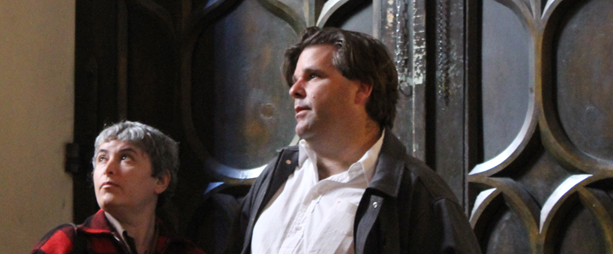

 

Kim Cooper and her husband, Richard Schave, are the proprietors of [Esotouric](http://www.esotouric.com), the Los Angeles company that upends the concept of the guided bus tour with excursions like [The Birth of Noir](http://esotouric.com/cain), [Raymond Chandler's Los Angeles](http://esotouric.com/chandler) and [The Real Black Dahlia](http://esotouric.com/blackdahlia). Together, they curate the [literary](http://lavatransforms.org/mussosalon) and [cultural](http://lavatransforms.org/lavasalonsfigaro) Salons of LAVA - The Los Angeles Visionaries Association, and host the podcast [You Can't Eat The Sunshine](http://www.esotouric.com/canteatsunshine).

Kim is a lapsed pop music critic whose [book](http://www.amazon.com/exec/obidos/ASIN/082641690X/ref=nosim/bubblegumbook) about Neutral Milk Hotel is the top seller of the 33 1/3 series. She is most recently the author of *<a href="http://www.thekeptgirl.com/2014/09/chandlermap.html" target="_blank">The Raymond Chandler Map of Los Angeles</a>* and of *[The Kept Girl](http://www.thekeptgirl.com)*, a novel featuring the young Raymond Chandler and real-life Philip Marlowe on the trail of a cult of murderous angel worshippers.