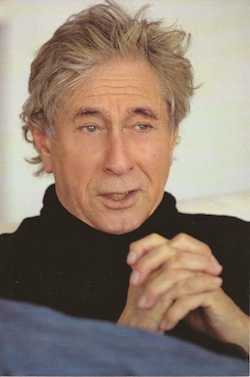

I think it's very, very smart and delightfully satiric with wonderful glimpses of the no nonsense straight forward writer Mr. Chandler was to become.  This could make an elegant light mini-operetta as I feel Mr. Chandler intended, if I, a Tony Award winner directed it and it is produced the old fashioned way with hand painted murals on canvas back drops and a small orchestra in the pit. Historically speaking, it's the very young Raymond Chandler having a very good time seeing what it's like to write an operetta from his fun, wise and unique point of view. I think it's a very good one and I believe it's an accessible piece for theatre goers of this and past generations to have a great time attending. I do hope his estate approves the release of this wonderful, witty "other and early side" of Mr. Chandler.

Paul Sand, Santa Monica, October 24, 2014

[About Paul Sand](http://en.wikipedia.org/wiki/Paul_Sand)
