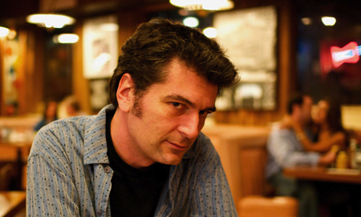

In the 1910's, operetta was kind of a going thing, especially if you had taste or money.  P&P is pretty typical of the type of entertainment inspired by Gilbert and Sullivan (and, to a different extent, Wagner).  Small-scale productions of new operettas were mounted in any town that declared itself somehow cultural.  This was the age of John Phillip Sousa's great popularity, of social dance in the style of Irene and Vernon Castle.  

That Chandler would get sucked into this kind of project while hanging with Gordon Pascal is not unlikely.  Chandler saw himself as cultured, even though he never really spoke of having his own taste in music.  Gordon's father, Julian Pascal, was a pianist with something of an international career.  No doubt he saw himself as a fellow who could compose.  He likely had a fundamental education in harmony, counterpoint, and the other stuff basic to a music education.  Chandler, an aspiring poet, could write the libretto.

Fans of Chandler know he was a prolific and even copious letter-writer, but nowhere does he mention P&P.  I doubt he thought it was bad work.  It's not at all. Both the music and libretto and charming and smart.   But the time during which this is being composed seems to coincide with Chandler's stealing Julian's wife, Cissy.  

Chandler in his letters is something of an arch-moralist.  That he would recall this work and the circumstances under which it was made would not fit at all with the Chandler that Chandler wanted to project to those with whom he discussed his life and work.  So he never mentioned it, or Pascal.

(Chandler often left out details that would make him look bad, especially when they had to do with his marriage.)

It would be wonderful if this work was somehow innovative or in some way important as something other than early Chandler.  But it's not.  It's important specifically as early Chandler, showing him as somebody very much at ease with his times and his intellectual community.  It tells us just who he thought he was as he was taking his first steps.

The idea of music-directing P&P is an antiquarian's delight.  The music has never been performed.  It has never been orchestrated fully.  It's a chance to go back in time and re-enter the creative process of one hundred years ago.  As someone who studied exotica with Les Baxter, composed for the Flintstones, worked as music director for historic LA figures like Big Jay McNeely, Lalo Guerrero, and Yma Sumac, the notion of this version of musical time travel is the ultimate enticement.  And working in some small way with Raymond Chandler is a serious thing.  He is one of the granite figures of Los Angeles letters, alongside Carey McWilliams and James Ellroy.

Skip Heller, Hollywood, October 24, 2014

[About Skip Heller](https://en.wikipedia.org/wiki/Skip_Heller)