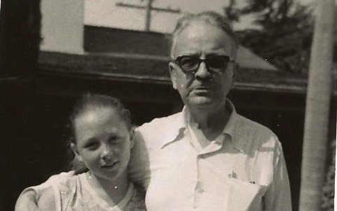
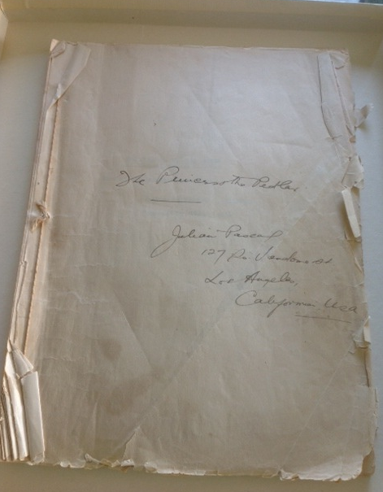
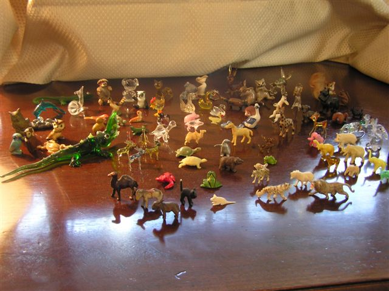

*Sybil & Ray, October 1958* (*Credit:  Davis Family Photos*)

I understand Kim Cooper’s passion for sharing *The Princess and the Pedlar* with the world. She is an extraordinary researcher and dedicated to keeping the memory of Raymond Chandler alive. Consequently she has unearthed a previously unknown work by Raymond Chandler, which demonstrates another side of his literary genius -- a comic opera no less.

Yet for me, the existence of this comic opera is nothing new. It has been in my safekeeping for over 50 years! In fact, when Kim told me of her discovery, the original manuscript given to me by Chandler was in a locked file cabinet no more than 60 feet from where we were sitting!

*Credit:  Davis Family Photos*

Ray gave the manuscript to me in the 1950s when I was twelve. Since Ray had no children of his own he came to think of me as a daughter. I considered him a father. Before our deep bond developed, Ray was fond of saying about children, "I like to hear the patter of little feet going away from me."

I have always regarded the manuscript as a deeply personal gift and not as another work by a great writer. It is a reminder of how much Ray loved me and my family in the years before his death when my mother worked for him as his personal secretary. Perhaps that is why I have guarded and protected it for so long along with all the other gifts he gave me.

Many of the gifts were objects or stories that he had previously given his wife, Cissy, who predeceased him. *The Princess and the Pedlar*, written by Chandler with a musical score by Cissy’s then husband, Julian Pascal, was most certainly a joint gift from them to her.

When Ray gave me the libretto, it did not include the musical score nor did he mention the score to me. The introductory pages listing the cast of characters do assign in handwriting who sings soprano, alto, tenor, etc.

I suspect Ray, who appreciated classical music, might not have cared for the score. Perhaps he thought it didn’t do his writing justice? 

To me the lyrics demand a more light hearted Gilbert and Sullivan-ish orchestration, something different from the music written by Pascal. Upon first reading the lyrics from the opening chorus sung by "female fairies grouped around in picturesque attitudes," one is tempted to burst into song, trilling music similar to "Three Little Maids From School Are We." Consider the opening lyrics: "You may possibly have heard / From some idle little bird / Who had nothing much to do / But to perch upon a tree / And to warble merrily / With his little head askew / That the fairy folk are gone / From the forest and the lawn / From the shade of the oak and yew."

I have always known that Ray loved and wrote fantasy. Just one example is how he inscribed an edition of *The Viking Book of Poetry of the English-speaking World* to his wife in 1941 for a Christmas present: "To The Queen of Tharundeen / From Galliboeth / Christmas 1941." These were endearing nicknames for one another, each derived from their love of made up fairy tales. Cissy sometimes inscribed her gifts of books to Ray, "To My Beolith."

Ray also made up stories for me, fantastic tales of make-believe characters living strange and extraordinary lives. Ray had a superb gift for creating eccentric characters who were extremely witty, filled with charm, humanity, and intrigue appealing to young minds. My favorites were the talking animals, perhaps inspired by the various miniature animals of jade, ivory, and crystal in a collection he and Cissy once collected — also a gift to me. One of the characters was called Julius Pringle. Could this be Julian Pascal?

*Credit:  Davis Family Photos*

I was waiting to introduce *The Princess and The Pedlar* to the world in a memoir I am writing about my life with Ray. It takes place while Ray was writing his last novel, *Playback*, which he dedicated to my mother. Even though *The Princess and The Pedlar* has now come to light, the memoir contains other never before revealed information about this multi-talented author whom I had the privilege of knowing and loving.

Sybil Anne Davis 

October 30, 2014